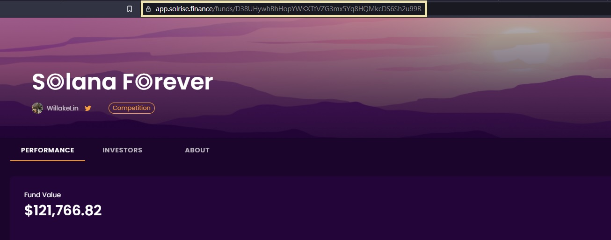

# Solrise Dawn Parasite
這個程式是為了在 Solrise 的投資比賽中取得排名而撰寫的，用途是寄生目標的投資策略來跟單，另外有 telegram 通知的功能。

## 安裝方式

### 環境架設
```
## install yarn
npm install -g yarn

## install typescript
npm install -g typescript

## install ts-node
npm install -g ts-node

## install packages
yarn
```

### 設定 .env
新增一個 .env 檔案到根目錄

```
## .env

## 將 TYPE_YOUR_FUND_ID 替換成自己的 fund id
MY_FUND_ID=TYPE_YOUR_FUND_ID

## 將 TYPE_TARGET_FUND_ID 替換成目標的 fund id
TARGET_FUND_ID=TYPE_TARGET_FUND_ID

## 將 TYPE_YOUR_TELEGRAM_BOT_TOKEN 替換成自己創的 Telegram 機器人的 token
TELEGRAM_BOT_TOKEN=TYPE_YOUR_TELEGRAM_BOT_TOKEN

## 將 TYPE_YOUR_CHAT_ID 替換成和機器人對話的 chat id
CHAT_ID=TYPE_YOUR_CHAT_ID
```

### 如何找到 Fund ID


如上圖所示，進入到某個基金的頁面，網址中 funds/ 後面的一串號碼就是 fund id

### 如何取得機器人 Token
可以照著 [Teleram 教學文件](https://core.telegram.org/bots)來操作已創立機器人

簡單的步驟就是把 [BotFather](https://t.me/botfather) 加到好友，照著他寫的指示做，就會得到 token 了

### 如何取得 Chat ID
先在 .env 中設定好 TELEGRAM_BOT_TOKEN，在 telegram 將機器人加入自己好友，再開啟一個 Group，只把機器人加進來，將它設為管理員，最後在群組裡講一句話，然後到下面的網址，將 ${token} 改為自己的 token，找到 chat 裡面的 id
```
https://api.telegram.org/bot${token}/getUpdates
```
最後就會得到 chat id，這樣設定好後需要更換投資方向的時候就能夠收到 telegram 機器人的通知

建議可以把機器人的通知音效另外設定，能夠比較容易分辨是來自機器的人通知，路徑是在 Telegram 畫面 Settings => Notifications and Sounds => Message Notifications => Exception

### 執行方式
可以直接以 ts-node 執行
```
yarn dev
```
或是建置出來後再執行
```
yarn build

node ./dist/main.js
```

### 定時
在 main.ts 中可以將任務定時，修改 x 就可以調整更新的區間（每幾秒一次）

```
scheduleJob(
  '*/x * * * * *',
  () => main()
);
```